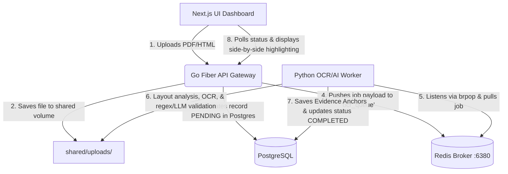

# ReguLens

> **Autonomous AI for Digital Trade Regulatory Discovery & Mapping**  
> Specifically targeting UNESCAP's RDTII (Readiness for Digital Trade Integration Index) framework (Pillars 5, 6, 7, 8, and 9).

---

## Table of Contents
1. [Project Overview](#project-overview)
2. [Architecture & How It Works](#architecture--how-it-works)
3. [The Tech Stack](#the-tech-stack)
4. [System Requirements](#system-requirements)
5. [Setup & Installation](#setup--installation)
6. [Running the Application](#running-the-application)
7. [Development Standards](#development-standards)
8. [Contributors](#contributors)

---

## Project Overview

**ReguLens** automates the discovery, extraction, and structured mapping of domestic regulatory evidence from primary legal sources (HTML documents, native PDFs, and scanned PDFs) to specific UNESCAP RDTII sub-indicators. 

---

## Architecture & How It Works

ReguLens follows a modern, highly concurrent asynchronous producer-consumer communication pattern:



1. **Upload**: The user uploads a legal document (PDF/HTML) in the Next.js frontend.
2. **Gateway Processing**: The Go Fiber API saves the file to a shared disk storage, initializes a PostgreSQL metadata record with status `PENDING`, and publishes a task to the Redis `ocr_queue` list.
3. **Queue Processing**: The Python AI/OCR Worker continuously monitors Redis via blocking `brpop`.
4. **Extraction & Verification**:
   - **Proposer Agent (Symbolic)**: Scans the document using regex keyword matching corresponding to UNESCAP indicators.
   - **Verifier Agent (Neural)**: Validates extracted paragraphs against local LLM (`ollama`) if active.
5. **Storage**: Verified evidence anchors (verbatim text, confidence, page location) are saved in PostgreSQL.
6. **Auditing**: Next.js renders the source document side-by-side with RDTII indicators; clicking an indicator highlights and scrolls to the exact verbatim anchor.

---

## The Tech Stack

- **Frontend**: Next.js 15 (App Router), React 19, TypeScript, Tailwind CSS
- **Backend API + Worker**: Python 3.11+ + FastAPI + uvicorn + SQLAlchemy (async) + asyncpg
  - OCR/AI Worker runs as a **daemon background thread** inside the FastAPI process
- **AI/OCR Engine**: pdfplumber (digital PDFs), pypdfium2 + pytesseract (scanned PDFs / Tesseract 5), BeautifulSoup 4 (HTML), Ollama (local LLM verification, optional)
- **Databases**:
  - **Relational**: PostgreSQL 15 (mapped to host port `5433` to avoid conflicts)
  - **Message Broker**: Redis 7 (mapped to host port `6380` to avoid conflicts)

---

## System Requirements

Ensure the following runtimes and binaries are installed on your host system:

| Dependency | Minimum Version | Installation / Command |
| :--- | :--- | :--- |
| **Node.js** | `v18.0.0+` | [Node.js Downloads](https://nodejs.org) |
| **Python** | `v3.11+` | `brew install python` (macOS) |
| **Docker** | `v20.10+` | [Docker Desktop](https://www.docker.com/products/docker-desktop) |
| **Tesseract OCR** | `v5.0+` | `brew install tesseract` (macOS) |

---

## Setup & Installation

### 1. Clone & scaffolding
Navigate to the project directory:
```bash
git clone <repository-url> regulens
cd regulens
```

### 2. Set Up Environment Variables
Create the `.env` configuration file in the root directory. We also have symlinks redirecting subfolders to this file:
```bash
# Create .env at root
cp .env.example .env  # Or write directly matching variables below
```

### 3. Spin Up Docker Containers (Postgres & Redis)
Clear any legacy volumes and launch the isolated database and message broker:
```bash
docker-compose down -v
docker-compose up -d --force-recreate
```
*Verify they are running on host ports `5433` (Postgres) and `6380` (Redis).*

### 4. Setup Python Backend Virtual Environment
Navigate to `backend/`, create a virtual environment, and install requirements:
```bash
cd backend
python3 -m venv venv
source venv/bin/activate
pip install -r requirements.txt
```

---

## Running the Application

Open two separate terminal windows:

### Terminal 1: Run FastAPI Backend (+ Background Worker)
```bash
cd backend
source venv/bin/activate
uvicorn main:app --reload --port 8085
```
*The backend starts, tables are auto-created, and the OCR/AI worker thread begins listening on Redis automatically.*

### Terminal 2: Run Next.js Frontend
```bash
cd web
npm run dev
```
*Open [http://localhost:3000](http://localhost:3000) to view the ReguLens Hub.*

---

## Development Standards
- **Zero-Cost Mindset**: All computation is mapped to local resources (local Tesseract, local Postgres/Redis containers, local Ollama models). Do not integrate paid cloud endpoints.
- **Strict Silo Boundaries**: Keep language frameworks cleanly separated (do not introduce Python modules to the Go API or vice versa).
- **Git Hygiene**: A root-level `.gitignore` handles exclusions. Never commit credentials, python virtual environments, or Next.js build directories.

---

## Contributors

- **Henry Salim** — Lead Developer & Maintainer ([@henrysalim](https://github.com/henrysalim))
- *Placeholder for additional contributors*
